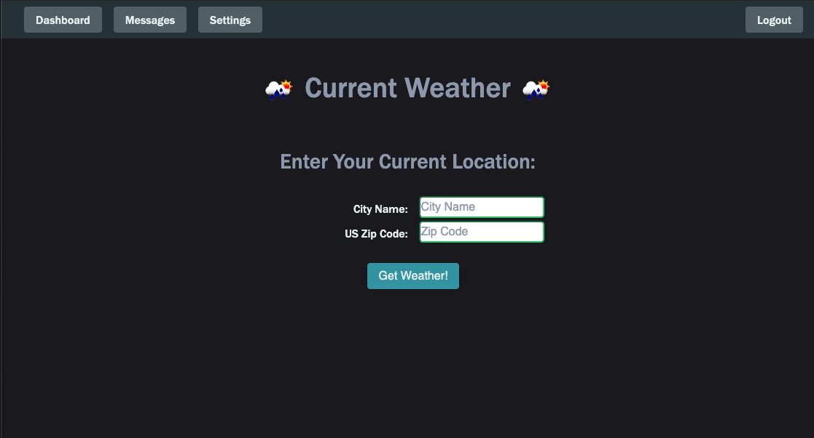
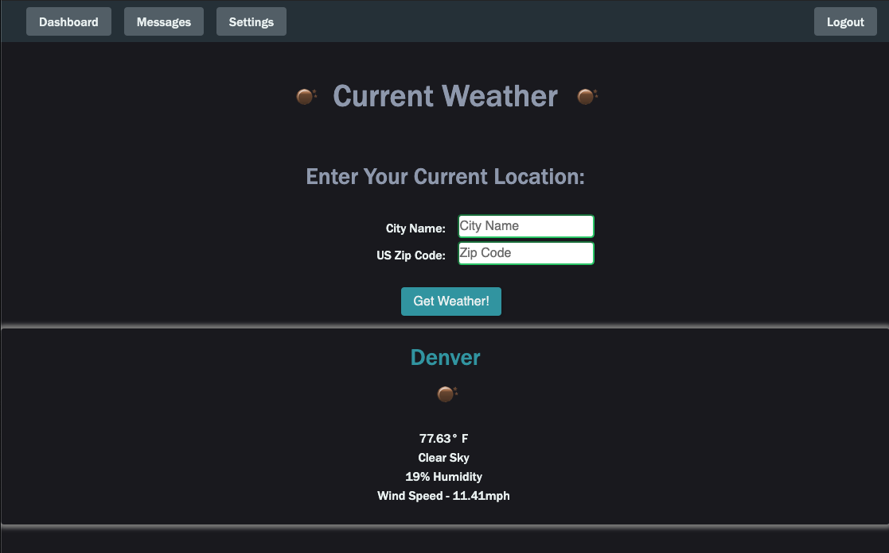
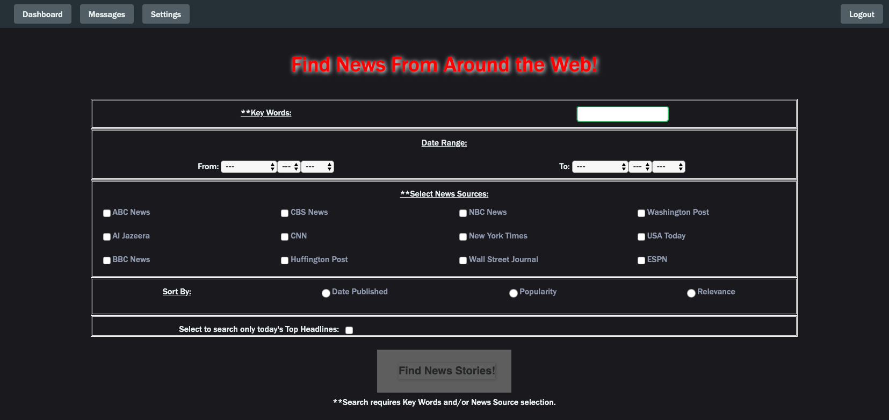
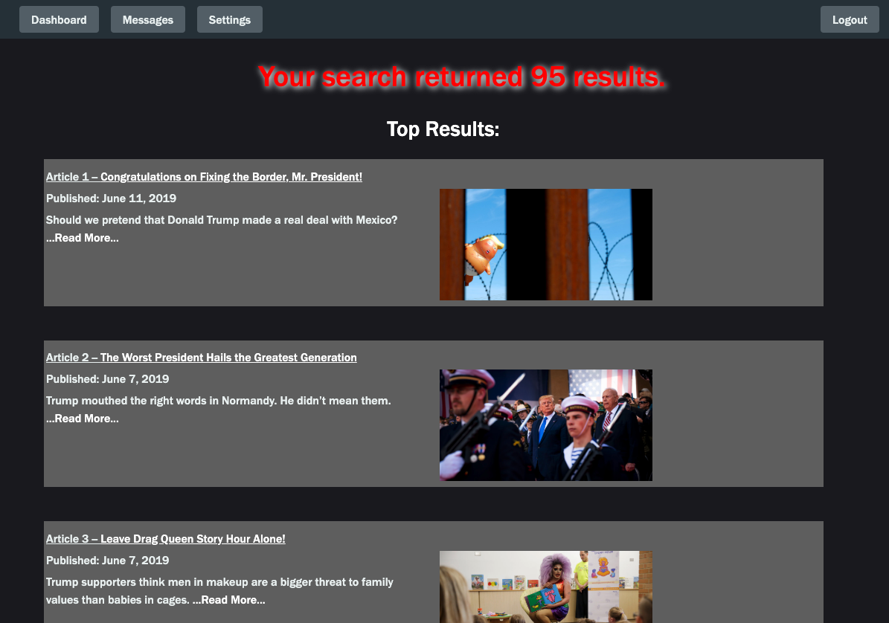
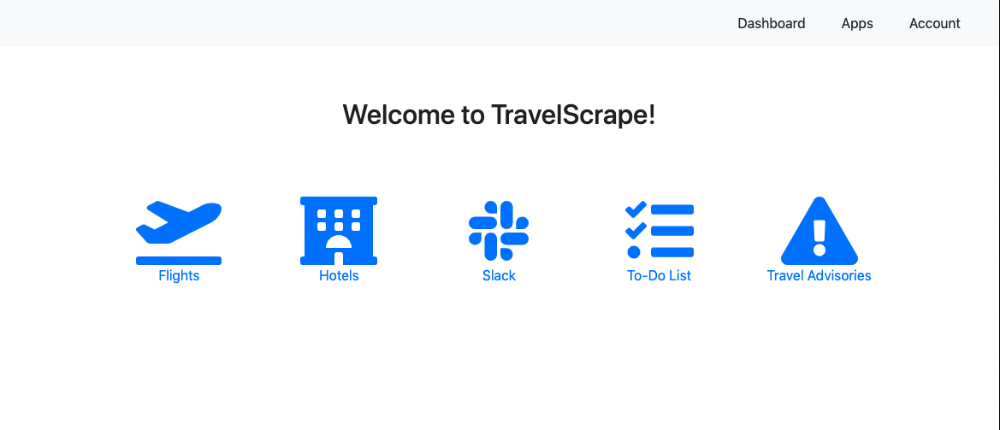
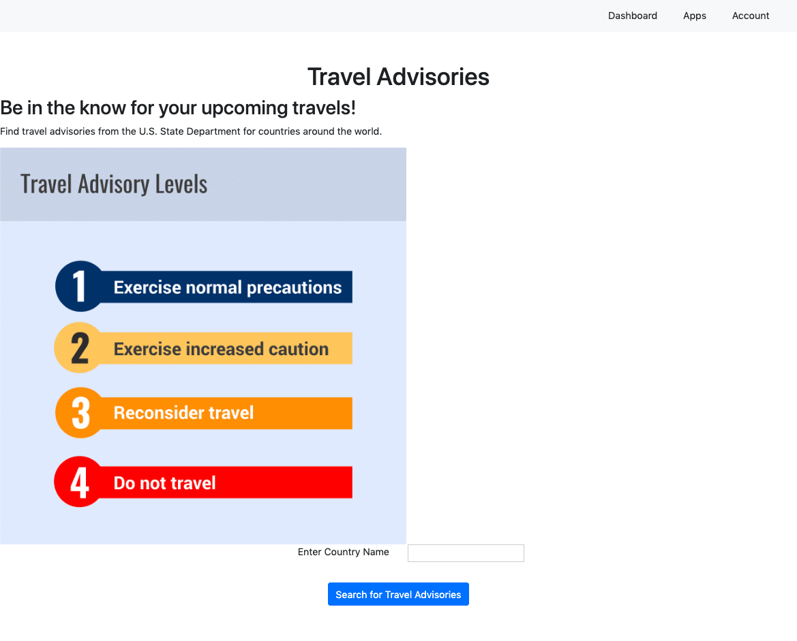
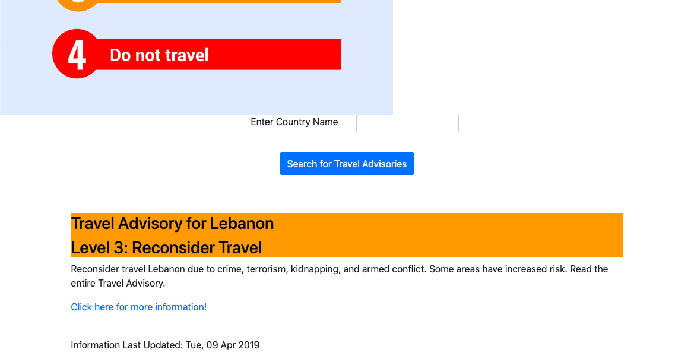

# Live Project - Tech Academy

## Introduction
For my last two weeks at the Tech Academy, I worked in a team with a group of my peers developing a full scale MVC Web Application in Python using Django. During this time, our group finished up tasks on an ongoing project, [DataScrape](#DataScrape-Stories), and began work on a new project, [TravelScrape](#TravelScrape-Stories). Working on a pre-existing codebase with the DataScrape project was a great opportunity to learn about fixing bugs, cleaning up code, and adding new features to existing apps. Later on, developing the TravelScrape project from scratch, allowed me to practice the proper setup for apps in Django and thorough commenting both in my code and commits so that future developers picking up my work would be able to do so more efficiently. Throughout the Live Project experience, the stories I worked on focused primarily on back-end functionality though I was also able to work with some front-end styling tasks in order to improve the user experience. Over the two-week sprint I had the opportunity to work in a team learning valuable professional [skills](#additional-skills-learned) that I'm confident I will utilize in future endeavors.

Below are descriptions of the stories I worked on in both projects along with relevant code snippets. Full code files for the snippets as well as a few additional supporting files I worked on are also available in this repo.

*Jump to: [TravelScape Stories](#TravelScrape-Stories), [Additional Skills](#additional-skills-learned)*

## DataScrape Stories
* [Weather App Functionality](#weather-app-functionality)
* [News App Development](#news-app-development)

### Weather App Functionality
The weather app was meant to display the current weather in a given location using data from openweathermap.org. However, it was not working properly as it was unable to gather the correct data from the API and display it. My task was to take the existing code and make it functional. I created a model for storing both the zip code and city name entered by the user. While in its current format, the data doesn't need to be stored and is cleared out at the end of each request, future versions of the app may choose to store location data in order to display multiple cities at once. The app currently relies on user input for location and gives priority to zip code over city name when requesting data from the openweathermap API. 

    def weather(request):

        # For initial call when no data has been entered
        if request.method == 'GET':
            form1 = ZipForm(initial={'zip': 'Zip Code',})
            form2 = CityForm(initial={'city': 'City Name'})
            location = {'form1': form1, 'form2': form2}
            return render(request, 'Weather/weather.html', location)

        # For when data has been entered
        elif request.method == 'POST':
            form1 = ZipForm(request.POST)
            form2 = CityForm(request.POST)
            form1.save()
            form2.save()

        # Reset the forms
        form1 = ZipForm()
        form2 = CityForm()

        # Grabs the entry for the city and for the zip code from the database
        city_name = City.objects.filter()[0]
        zip_code = Zip.objects.filter()[0]

        # Enter API key here - limited attempts in free access so may need to make new account if not working
        api_key = "717773b8d51cee768b8ceb819ad9aeb3"
        # base_url variable to store url - units=imperial converts from default of Kelvin
        base_url = "http://api.openweathermap.org/data/2.5/weather?units=imperial&"
        # complete_url variable for user specific url lookup - give zip code entry priority
        complete_url = base_url + "appid=" + api_key + "&zip=" + str(zip_code) + ",us"

        # get data from the url
        response = requests.get(complete_url)

        # convert json format data into python format data
        x = response.json()

        # Now x contains all the url info in dictionary form
        # Check the value of "cod" key isn't 404/400 aka location not found/invalid entry
        if x["cod"] != "404" and x['cod'] != "400":

            # Simplifying the calls into the dictionary with y
            y = x['main']
            z = x['weather']
            w = x['wind']

            # Grabbing info of interest to display in forms
            location = x['name']
            current_temp = y["temp"]
            current_humidity = y['humidity']
            weather_description = z[0]['description']
            description = weather_description.title
            weather_icon = z[0]['icon']
            wind_speed = w['speed']

            icon_url = "http://openweathermap.org/img/w/" + weather_icon + ".png"

            # Put it all together into a dictionary
            current_info = {"location": location, "current_temp": current_temp, "current_humidity": current_humidity,
                            "description": description, "icon": icon_url, "wind_speed": wind_speed}
            # Create 'context' to return at the end
            context = {'current_info': current_info, 'form1': form1, 'form2': form2}

        # If the Zip Code does return a 404, this prompts it to check the city name entered
        else:
            complete_url = base_url + "appid=" + api_key + "&q=" + str(city_name)
            # Get new values based on city name rather than faulty zip code
            response = requests.get(complete_url)
            x = response.json()

            # If city name returns info, create context to return to user
            if x["cod"] != "404" and x['cod'] != '400':
                # Simplifying the calls into the dictionary with y
                y = x['main']
                z = x['weather']
                w = x['wind']

                # Grabbing info of interest to display in forms
                location = x['name']
                current_temp = y["temp"]
                current_humidity = y['humidity']
                weather_description = z[0]['description']
                description = weather_description.title
                weather_icon = z[0]['icon']
                wind_speed = w['speed']

                icon_url = "http://openweathermap.org/img/w/" + weather_icon + ".png"
                current_info = {"location": location, "current_temp": current_temp, "current_humidity": current_humidity,
                "description": description, "icon": icon_url, "wind_speed": wind_speed}
                context = {'current_info': current_info, 'form1': form1, 'form2': form2}

            # If city name also returns a 404/400, return the error to the user
            else:
                error = {"not_found": "City Not Found: Please Re-enter Location Information"}
                context = {'error': error, 'form1': form1, 'form2': form2}

        # Clears out the tables Zip and City to prevent them from growing indefinitely
        Zip.objects.all().delete()
        City.objects.all().delete()

        return render(request, "weather/weather.html", context)       

The initial screen brought up by the user presents a form for entering their location.

Once returned, the screen gives the current weather information for their location and changes the weather icons in the heading to match.

*Jump to: [Top of Page](#live-project---tech-academy)*

### News App Development
I was tasked with creating a news app that would display the top articles returned by user-given search parameters using data from newsapi.org. The app creates a url based on the search parameters entered by a user to retrieve a JSON response from the API and then generate a user friendly presentation of the results. The users can choose multiple filters including date published (though this was limited by the free API used for the project), news source, and key words. A news source or key word must be entered or an error explaining this is returned to the user. Each article returned presents the date published, title with a link to the full story, news source, a base description of the story, and an image from the story. The initial page presented shows the results from a default search for top headlines in the USA today.

I created a search form for the user to input the data using multiple widgets. No models were created to store the search criteria.
    
    class SearchForm(forms.Form):
        SOURCE_CHOICES = (('abc-news', 'ABC News'), ('al-jazeera-english', 'Al Jazeera'), ('bbc-news', 'BBC News'),
                        ('cbs-news', 'CBS News'), ('cnn', 'CNN'), ('the-huffington-post', 'Huffington Post'),
                        ('nbc-news', 'NBC News'), ('the-new-york-times', 'New York Times'),
                        ('the-wall-street-journal', 'Wall Street Journal'), ('the-washington-post', 'Washington Post'),
                        ('usa-today', 'USA Today'), ('espn', 'ESPN'))
        SORT_CHOICES = (('date', 'Date Published'), ('popularity', 'Popularity'), ('relevance', 'Relevance'))

        key_words = forms.CharField(label='Key Words', max_length=100, required=False)
        # The free plan only allows for 1 month worth of news archives - can go further back with paid API KEY
        date_earliest = forms.DateField(label='From', widget=forms.SelectDateWidget(years=range(2019, datetime.date.today().year+1)), required=False)
        date_latest = forms.DateField(label='To', widget=forms.SelectDateWidget(years=range(2019, datetime.date.today().year+1)), required=False)
        sources = forms.CharField(label='Select News Sources', widget=forms.CheckboxSelectMultiple(choices=SOURCE_CHOICES), required=False)
        sort = forms.CharField(label="Sort By", widget=forms.RadioSelect(choices=SORT_CHOICES), required=False)
        search_type = forms.CharField(label="Select to search only today's Top Headlines", widget=forms.CheckboxInput, required=False)

        def clean(self):
        clean_form = self.cleaned_data
        return clean_form

Below this form is populated with the results from the default search of top headlines in the USA today.

Upon the user submitting search criteria, the app generates a url and parses the JSON data returned from the API. 

        # set up base_url depending on if it's a headline search or not
        if form['search_type'] == 'True':
            base_url = 'https://newsapi.org/v2/top-headlines?'
        else:
            base_url = 'https://newsapi.org/v2/everything?'

        # grab the search data
        key_words = form['key_words']
        start_date = form['date_earliest']
        end_date = form['date_latest']
        sort = form['sort']
        sources = form['sources']

        # parse sources into proper string for url if any were entered
        if sources != '':
            src_list = ast.literal_eval(sources)
            sources = ','.join(src_list)

        api_key = 'b21c9ca0b07c4a1e950b725f85ca4ad2'

        # format full url for query using input
        url = '{}q={}&from={}&to={}&sources={}&sortBy={}&apiKey={}'\
            .format(base_url, key_words, start_date, end_date, sources, sort, api_key)

        # get data from the url
        response = requests.get(url)

        # convert json format data into python format data
        x = response.json()

        # check for errors in query to determine response to user
        if x['status'] == 'ok':  # no errors detected
            message = 'Your search returned ' + str(x['totalResults']) + ' results.'
            articles = x['articles']
            art_list = []
            # setting up an int for index value in articles
            i = 0
            # iterating through the dictionary of info on the articles for relevant info and putting into list to return
            for article in articles:
                y = articles[i]
                title = y['title']
                description = y['description']
                image = y['urlToImage']
                link = y['url']
                date_pub = datetime.datetime.strptime(y['publishedAt'], "%Y-%m-%dT%H:%M:%SZ")
                date = date_pub.date()
                info_list = [i+1, title, description, image, link, date]
                art_list.append(info_list)
                i = i + 1
            # return form, message, and info on articles to the html page
            return render(request, 'AppDemoNews/news_data.html', {'form': search_form, 'message': message, 'list': art_list})

The HTML file contains a for loop to go through and present each result therefore enabling it to cleanly handle a varying number of results based on the search.

    
        

            <ul>
                

                <li>
                    

                        Article {{ item.0 }} --
                        <a href="{{ item.4 }}" target="_blank">{{ item.1 }}</a>
                    

                    
Published: {{ item.5 }}

                    
{{ item.2 }} <a href="{{ item.4 }}" target="_blank">...Read More...</a>

                    

                </li>
                

            </ul>
        

    

Above these returned results is also the returned form still containing the entered search parameters.

*Jump to: [Top of Page](#live-project---tech-academy)*

## TravelScrape Stories
* [Travel Advisory App](#travel-advisory-app)

### Travel Advisory App
As our team was the first to work on the TravelScrape project, there was no pre-existing code. I was tasked with developing an app to allow users to search for a country in order to see any current travel advisories from the US State Department. The app was required to display an explanation of the different warning levels as well as the color of the warning level currently given for the search county. In addition, it provides a brief description of situation from the State Department and a link to the full travel advisory page for futher information and resources. Using information provided from travel.state.gov, the app parses the data returned in an xml format from the site based on the search criteria and presents it to the user.

        # validating and cleaning data for use
        if form.is_valid():
            form = form.cleaned_data

        # grabbing user input for country
        country = form['country']
        # alter data to fit - all country names capitalized in url data
        country = country.capitalize()

        # url with information from state department on travel warnings
        url = 'https://travel.state.gov/_res/rss/TAsTWs.xml'

        # getting data from url and then parsing it into a dictionary form (from xml)
        r = requests.get(url)
        data = xmltodict.parse(r.content)
        # grabbing information on the actual countries out of the dictionary for easier access below
        x = data['rss']['channel']['item']

        # scanning through the dictionary for the country chosen by the user and grabbing that country's data
        country_info = ''
        i = 0
        for item in x:
            if country in "'+{}+'".format(x[i]['title']):
            country_info = x[i]
            i += 1

        # in case the country cannot be found
        if country_info == '':
            error_message = 'No information on {} could be found at this time. Please check that the ' \
            'country name is spelled correctly and try again.'.format(country)
            print(error_message)
            return render(request, 'Advisory/advisory.html', {'form': CountryForm(), 'error': error_message})

        title_full = country_info['title']
        # removing country name from title so it can be displayed more prominently elsewhere
        title = title_full.replace(country+' - ', '')
        date = country_info['pubDate']
        link = country_info['link']
        description_html = country_info['description']
        # parsing out the long description and grabbing the initial paragraph's text to present to user
        description_long = BeautifulSoup(description_html, features='html.parser')
        description = description_long.p.text

        # scanning through the country data info (it's title) to grab the warning level. Levels range from 1-4
        i = 1
        while i < 5:
            if 'Level {}'.format(i) in country_info['title']:
            alert_level = i
            i += 1
        # assigning color based on alert level for in-line styling for background and font on the html section
        if alert_level == 1:
            alert_color = 'DarkBlue'
            font_color = 'White'
        elif alert_level == 2:
            alert_color = 'Yellow'
            font_color = 'Black'
        elif alert_level == 3:
            alert_color = 'Orange'
            font_color = 'Black'
        elif alert_level == 4:
            alert_color = 'Red'
            font_color = 'Black'

        warning_info = {'country': country, 'title': title, 'date': date, 'link': link, 'description': description,
                        'alert_color': alert_color, 'font_color': font_color}

        # returning information to be displayed and blank form
        return render(request, 'Advisory/advisory.html', {'form': CountryForm(), 'info': warning_info})

I set up a working widget on home page to access the app.

The initial page displays the search form with an image explaining warning levels (minimal styling was done due to time constraints)

The returned page includes in-line styling to allow for the warning color variable to alter the background of the title line to match the warning level given.

*Jump to: [Top of Page](#live-project---tech-academy)*

## Additional Skills Learned
* Working with a team of developers to assist each other in identifying bugs within existing code and to the improve usability of an application
* Utilizing project management programs to improve project flow
* Utilizing version control, regularly committing work, and thoroughly commenting code.
* Learning from other developers by observing their workflow, asking questions, and hearing their feedback at our daily standups  
* Practice working with a remote team and utilizing communication tools (particularly Slack)
* The importance of flexibility, self-motivation, continuous research, and agile design
    * The WeatherApp story was initially meant to utilize the location under the user profile of the user. However, there was a bug that prevented the user from editing any of their profile. We moved forward with the WeatherApp utilizing user imput in order to make the app functional until the bug could be fixed. 
    * No one on the project was familiar with the State Department's API. After some research, I was able to find the resource to get up-to-date travel advisories in an xml format.

*Jump to: [Top of Page](#live-project---tech-academy)*
